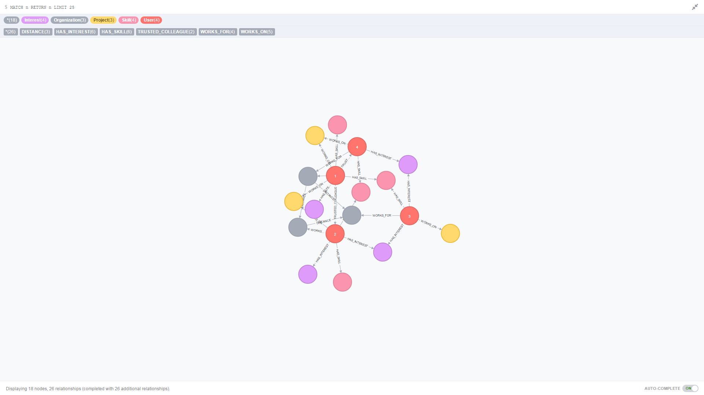
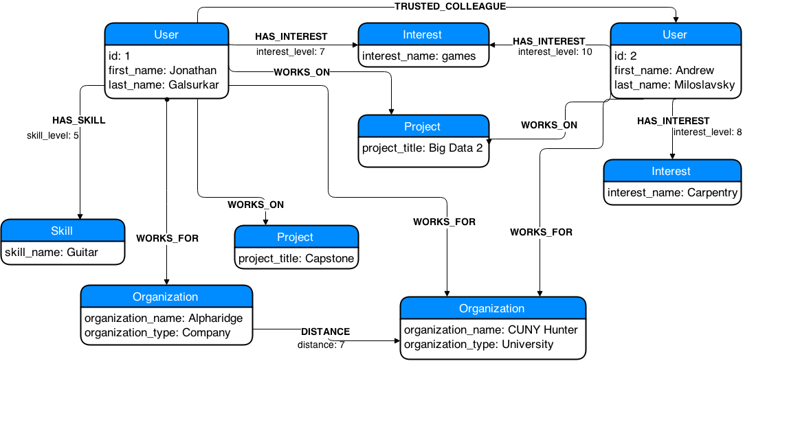

# Graph database to model Collaborator.net

Collaborator.net is an application that enables users to discover their own professional network and
identify other users with particular skill sets. Users work for organizations (governments, universities, or
companies), work on projects, and have one or more interests or skills that are weighted by their significances 
or levels. Based on this information, collaborator.net can
- describe a user’s professional network by identifying other subscribers by a defined criteria
- identify collaborators with specific skills who are directly or indirectly connected to the current user

Requirement
• Build a database to model collaborator.net
• At least five entities for each entity-type or relations for each relation-type.
• The database should at least answer the following questions in
  a quick response time:
	– For a user, find all other individuals who share the same
	interests or skills as the user, and work in the same or different
	organization within x miles from the organization that the user
	works. The individuals should be ranked by the total weight of
	shared interests (or skills) with the user. In addition, the output
	should include the organization name, and the list of common
	interests (or skills).
	– For a user, find all trusted colleagues-of-colleagues who have one or
	more particular interests. The “trusted colleague” is defined as two
	persons have worked on the same project.
• A Python command-line client interface for database creation and query

### Technology Used
- Neo4J
- Python

###Program Arguments:
-Folder path that contains the files to be loaded into the database
-Config file which will be used to get the username and password required to bind to the database

### Preview of a subset (graph was too big)

### UML Diagram

### Potential Improvements
1. When we use PERIODIC COMMIT to commit queries in stacks of 10000, we do so in an attempt to prevent any out of memory exceptions. 
It is successful in doing so in our tests, however there is still a possibility of a memory error due to Eager Loading. Eager Loading 
is when a query for one entity type also loads related entities as part of the query. It is sometimes valuable to circumvent eager loading 
through the manipulation of queries, such as splitting a query into multiple parts and isolating changes in queries that affect any MATCH/MERGE 
statements that follow.

2. Indexing could possibly be used more to allow for a faster and more efficient search when using MATCH or MERGE. However, it can also be 
counter-productive to index too many nodes or relationships, as it may eventually slow down querying. We chose to keep it to only User and 
Organization since they were the most commonly referenced nodes. However, adding an Interest index could have increased the query speeds
for this particular project.

3. Increasing the amount of memory allocated to Neo4j could be beneficial in speeding up queries. This goes hand in hand with the Cache Type
implementation in Neo4j. There are 5 Cache Types -- none, soft, weak, strong, hpc. Depending on how big the graph is, the nodes and relationships 
can be loaded into memory for varying amounts of time. For example, if the graph is small, then in a Strong type cache the graph can be loaded 
entirely into the cache and better performance could be achieved. We kept the default of the soft type cache, which provides an optimal balance
between performance and memory management. The HPC cache type might be best for large graphs, as it assigns dedicated memory for nodes and 
relationships which has a small footprint.